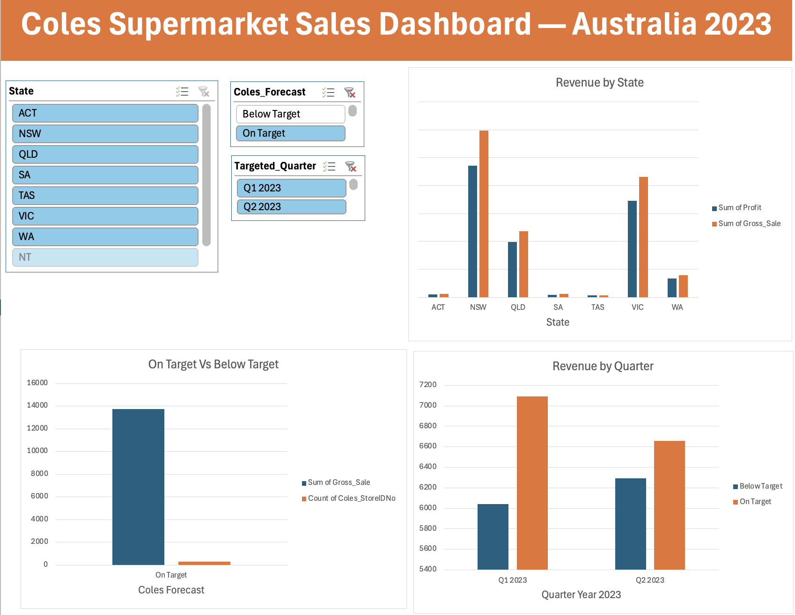

# Coles Supermarket Sales Dashboard
## Advanced Excel Dashboard Project — Australia 2023

### Overview
Interactive Excel dashboard analysing 625 Coles supermarket stores across Australia using advanced Excel features including VLOOKUP, PivotTables, PivotCharts and Slicers.

### Features
- VLOOKUP to combine two datasets
- 3 PivotTables with PivotCharts
- Interactive Slicers (State, Forecast, Quarter)
- Professional dashboard layout

### Business Questions Answered
1. Which Australian state generates most revenue?
2. How many stores are On Target vs Below Target?
3. How does performance compare Q1 vs Q2 2023?

### Key Findings
1. VIC and NSW are top revenue states
2. On Target stores generate more revenue despite fewer stores
3. Q1 2023 outperformed Q2 2023

### Tools Used
- Microsoft Excel (VLOOKUP, PivotTable, Slicers)
- GitHub

### Author
Munna Naharki | Google Data Analytics Certificate | MBA Analytics (VU Sydney 2026)

